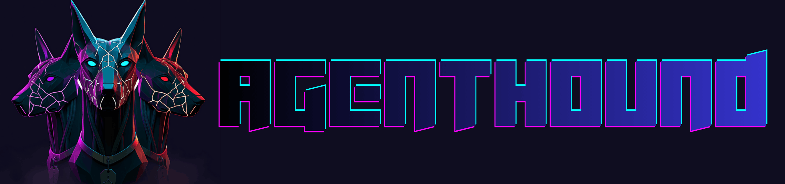
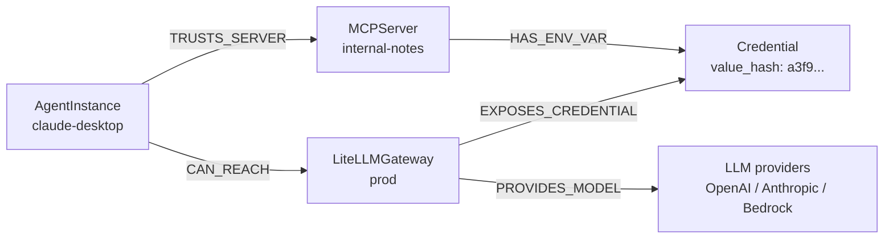
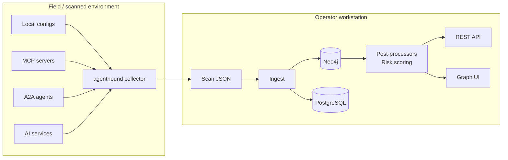

<div align="center">




**Attack-path discovery for MCP, A2A, and AI-agent infrastructure.**
---
BloodHound for MCP servers, A2A agents, AI services, local configs, credentials, tools, prompts, and agent sprawl.

[Docs](https://docs.agenthound.io) ·
[Quickstart](https://docs.agenthound.io/getting-started/quickstart/) ·
[Graph Model](https://docs.agenthound.io/reference/graph-model/) ·
[CLI](https://docs.agenthound.io/reference/cli/) ·
[Security](https://docs.agenthound.io/operator/security/) ·
[Contributing](CONTRIBUTING.md)

[](https://github.com/adithyan-ak/agenthound/actions/workflows/ci.yml)
[](https://github.com/adithyan-ak/agenthound/releases)
[](https://goreportcard.com/report/github.com/adithyan-ak/agenthound)
[](LICENSE)

</div>

<p align="center">
  
</p>

> **Authorized use only.** AgentHound includes read-only discovery and active assessment modules. Run it only against infrastructure you own or have written authorization to assess. See [Responsible Use & Security Posture](#responsible-use--security-posture).

AgentHound maps the trust relationships inside modern AI-agent stacks, turns them into a Neo4j graph, and surfaces the paths that matter: what an agent can reach, execute, impersonate, or exfiltrate through.

It ships as two binaries:

- **`agenthound`**: a lean collector that enumerates local configs, MCP, A2A, and AI-service surfaces, then emits JSON.
- **`agenthound-server`**: a localhost analysis server with Neo4j, PostgreSQL, a REST API, post-processors, and a React graph UI.

## Why AgentHound?

Static config scanners read one file at a time. Attack paths do not.

An agent may trust one MCP server. That server may expose a credential. A separate service may be authorized by the same credential. No single config file declares the full path, but the combined graph does.

AgentHound joins those facts into a directed trust graph so you can ask:

```text
Which agents can reach shell-capable tools?
Which credentials create cross-service paths?
Which poisoned tools sit on high-risk routes?
Which agents can read sensitive data and send it outbound?
```

That is the BloodHound idea applied to AI-agent infrastructure.

## Path Primitives

AgentHound does not just list findings. It creates graph edges you can chain, query, and report:

- **`CAN_REACH`**: an agent can traverse trust, credential, host, or protocol relationships to reach a target.
- **`CAN_EXECUTE`**: an agent can reach a tool capable of command, database, network, or code execution.
- **`CAN_EXFILTRATE_VIA`**: an agent can read sensitive data and send it through an outbound channel.
- **`CAN_IMPERSONATE`**: an agent or identity can act as another trust principal.
- **`SHADOWS`**: a tool mimics a trusted tool closely enough to hijack expected behavior.
- **`POISONED_DESCRIPTION` / `POISONED_INSTRUCTIONS`**: tool or instruction text contains model-steering content.

These edges turn AI-agent infrastructure into something you can pathfind instead of manually reason about.

## Example Path



No single config file declares this path. AgentHound computes it once collector output lands in the same graph.

## What AgentHound Finds

AgentHound's detections are built around the questions security teams ask when they need to understand reachability, blast radius, and pathing risk.

| Finding | What it means | Security question |
|---|---|---|
| **Credential-chain paths** | The same secret appears in multiple contexts, letting trust cross service boundaries. | Which reused credential gives an agent access it never explicitly had? |
| **Reachability** | Agents, MCP servers, tools, resources, prompts, A2A skills, and AI services are joined into one graph. | What can this agent actually reach if trust edges are followed? |
| **Execution paths** | An agent can reach shell-like, database, network, or other high-impact tools. | Which agents have a path to command execution, data-plane control, or production impact? |
| **Exfiltration paths** | An agent can read sensitive data and also reach an outbound channel. | Where can sensitive data leave the environment? |
| **Cross-protocol pivots** | MCP, A2A, host context, and AI-service infrastructure combine into one reachable path. | Can one agent protocol become a bridge into another trust domain? |
| **Tool poisoning** | Tool descriptions, prompts, or instruction files contain suspicious model-steering content. | Which tools or instructions could influence model behavior in unsafe ways? |
| **Tool shadowing** | A lookalike tool mimics a trusted capability or name. | Which tool could intercept or hijack an expected action? |
| **Rug pulls** | A tool's description changed between scans. | What changed since the last known-good graph, and did it create a new risk path? |
| **Unauthenticated servers or agents** | MCP servers or A2A agents are reachable without expected authentication. | Which exposed agent surfaces need immediate review? |
| **Risk hotspots** | Nodes and paths are prioritized with risk scores and prebuilt graph queries. | Where should investigation or remediation start first? |

See [Detection Rules](https://docs.agenthound.io/reference/detection-rules/) and [Risk Scoring](https://docs.agenthound.io/reference/risk-scoring/) for the full catalog.

## Quick Start

Prerequisites: Docker + Compose v2. No Go, no Node.js, no `git clone` — the server runs from a pre-built image and the collector is a single static binary.

```bash
# 1. Start the analysis server (Neo4j + Postgres + UI, binds 127.0.0.1:8080).
#    --wait blocks until the healthcheck reports ready, so step 3 below
#    can pipe in immediately without racing the server.
curl -sSfL https://raw.githubusercontent.com/adithyan-ak/agenthound/main/docker/docker-compose.public.yml \
  | docker compose -f - -p agenthound up -d --wait

# 2. Install the collector (single static binary, ~9 MiB → ~/.local/bin)
curl -sSfL https://raw.githubusercontent.com/adithyan-ak/agenthound/main/install.sh | sh
export PATH="$HOME/.local/bin:$PATH"     # add to ~/.zshrc or ~/.bashrc to persist

# 3. Scan and stream straight into the running server
agenthound scan --config --output - \
  | curl --data-binary @- -H "Content-Type: application/json" \
         http://127.0.0.1:8080/api/v1/ingest

# 4. Open the UI
open http://127.0.0.1:8080
```

No tokens, no logins, no drag-drop. The server admits non-browser callers (curl, the agenthound CLI, cron) and rejects cross-origin POSTs from your browser. Single-user, localhost-only — see [security model](docs/operator/security.md).

<details>
<summary><strong>Other install and ingest options</strong></summary>

```bash
# Drag-drop a scan file into the UI's Scan Manager (zero-CLI ingest)
agenthound scan --config
open http://127.0.0.1:8080   # then drop scan-*.json into the Scan Manager

# Build from source (requires Go 1.25+ and Node.js 20+)
git clone https://github.com/adithyan-ak/agenthound.git && cd agenthound
docker compose -f docker/docker-compose.yml up -d --build   # builds server image locally
make build                                                  # bin/agenthound + bin/agenthound-server

# Install the collector with Go
go install github.com/adithyan-ak/agenthound/collector/cmd/agenthound@latest

# Install and start the server with Go (skips Docker entirely; you supply Neo4j + Postgres)
go install github.com/adithyan-ak/agenthound/server/cmd/agenthound-server@latest
agenthound-server serve

# Pin install.sh to a release tag (verifies checksums; uses cosign when available)
curl -sSfL https://raw.githubusercontent.com/adithyan-ak/agenthound/v<VERSION>/install.sh | sh
```

See the full [installation guide](https://docs.agenthound.io/getting-started/install/) for Homebrew, release binaries, signature verification, and source builds.

</details>

## How It Works



The collector stays small and portable: no Neo4j driver, no PostgreSQL client, no UI, and no server dependencies. It writes JSON and exits. The server owns ingestion, deduplication, graph writes, post-processing, query APIs, and visualization.

AgentHound's graph model includes agents, MCP servers, tools, resources, prompts, credentials, hosts, config files, instruction files, A2A agents, AI-service nodes, and model nodes. Composite edges such as `CAN_REACH`, `CAN_EXECUTE`, `CAN_EXFILTRATE_VIA`, `CAN_IMPERSONATE`, `SHADOWS`, `POISONED_DESCRIPTION`, and `POISONED_INSTRUCTIONS` are computed after ingest.

Read the full schema in the [graph model reference](https://docs.agenthound.io/reference/graph-model/).

<p align="center">
  
</p>

## Where It Fits

- **Initial access triage**: identify agent surfaces exposed without expected authentication.
- **Privilege expansion**: find reused credentials and trust paths between agents, tools, hosts, and services.
- **Objective pathing**: query routes to shell-like tools, databases, model gateways, and sensitive resources.
- **Evidence packaging**: report graph-backed paths instead of hand-wavy config observations.
- **Retest validation**: compare scans to prove a critical path disappeared.

## Responsible Use & Security Posture

AgentHound is built for authorized assessment and internal visibility. Active modules are for sanctioned testing only and are documented separately. The operator is responsible for authorization for every target.

- The collector is offline by default and writes JSON to a file or stdout.
- The server binds to `127.0.0.1:8080` by default.
- The server is single-user with no application-layer login. Do not expose it beyond localhost; read endpoints may surface collected graph contents.
- Mutating localhost API endpoints are gated by an Origin allowlist (`OriginGuard`); cross-origin browser POSTs are rejected, non-browser callers (curl, the agenthound CLI) pass through.
- TLS verification is strict by default for supported network modules.
- Destructive or mutating assessment workflows require explicit operator intent and should be used only within a written scope.

Read the [security posture guide](https://docs.agenthound.io/operator/security/) and [offensive actions guide](https://docs.agenthound.io/operator/offensive-actions/).

## Documentation

Full documentation lives at [docs.agenthound.io](https://docs.agenthound.io).

Start with:

- [Quickstart](https://docs.agenthound.io/getting-started/quickstart/)
- [Installation Guide](https://docs.agenthound.io/getting-started/install/)
- [CLI Reference](https://docs.agenthound.io/reference/cli/)
- [Configuration Guide](https://docs.agenthound.io/reference/configuration/)
- [Graph Model](https://docs.agenthound.io/reference/graph-model/)
- [Detection Rules](https://docs.agenthound.io/reference/detection-rules/)
- [Deployment Guide](https://docs.agenthound.io/operator/deployment/)
- [Security Posture](https://docs.agenthound.io/operator/security/)

## Contributing

AgentHound is built around small, self-registering modules and a stable ingest format. Collectors, detections, and post-processors are designed to be extended without pulling server dependencies into the collector.

Start with [CONTRIBUTING.md](CONTRIBUTING.md) and the [module authoring guide](https://docs.agenthound.io/contributing/modules/). Found a vulnerability in AgentHound itself? See [SECURITY.md](SECURITY.md).

## License

AgentHound is licensed under the [Apache License 2.0](LICENSE).
