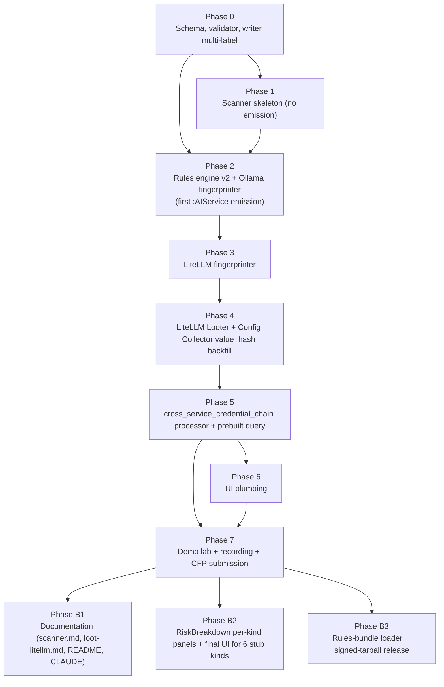

# AgentHound v0.2 — Implementation Plan

> **Companion to `docs/plans/sprint3-offensive-primitives.md`.** That doc says *what* and *why*. This doc says *how, in what order, with what verification*.
> **Final location once approved:** `docs/plans/v0.2-implementation.md`.
> **No effort or timeline estimates.** Phases are defined by dependency order, deliverables, and acceptance criteria. Execution speed is the implementer's call.

---

## Context

v0.1 of AgentHound shipped a defensible posture-mapping tool: three collectors, a Neo4j graph, 17 prebuilt queries, a React UI. The credential-chain pitch lands only when the graph contains discovered AI infrastructure — which v0.1 cannot find. v0.2 closes that gap with three load-bearing primitives:

1. A network scanner that finds AI services on a CIDR.
2. A LiteLLM Looter that extracts upstream provider credentials via the master key.
3. The schema and UI plumbing that surfaces those finds as a credential-chain attack path the existing post-processors can traverse.

The single demo this enables: `agenthound scan <cidr>` discovers an Ollama and a LiteLLM, `agenthound loot --type litellm` extracts upstream OpenAI/Anthropic/Bedrock keys, and the graph shows the credential chain from agent through MCPServer through env-var-cred through LiteLLM master to provider key. That demo is the **DEF CON 34 Red Team Village** submission (CFP closes 2026-05-31, talk happens 2026-08-06–09).

Everything else from the original eight-service plan slips to v0.3 (Ollama Looter, vLLM/Open WebUI/Jupyter fingerprinters) or v0.4 (Qdrant/MLflow/LangServe).

---

## Architectural decisions

These resolve the open questions surfaced during the architect-review pass. They lock in before Phase 0 commits.

### A. Writer multi-label approach: `MERGE` on per-kind label, then `SET` umbrella label

**Decision:** When a node arrives with `kinds: ["LiteLLMGateway", "AIService"]`, the writer issues a Cypher template of the form:

```cypher
MERGE (n:LiteLLMGateway {objectid: node.id})
ON CREATE SET n = node.properties, ...
ON MATCH SET ...
SET n:AIService
```

`groupNodesByKind` in `server/internal/graph/writer.go:243` is rewritten to group by the full sorted `Kinds` tuple, not just `Kinds[0]`. Each tuple gets its own cached Cypher template with `Kinds[1:]` inlined as static `SET n:Label` clauses (Neo4j cannot parameterize labels).

**Why not `MERGE (n:KindA:KindB ...)`:** Neo4j matches that pattern only if both labels exist. A single-labeled node from a previous version would never match, breaking idempotent re-ingest. The `MERGE on per-kind, SET umbrella` approach preserves the per-kind uniqueness constraint as the merge key and applies the umbrella idempotently.

This fix is **Phase 0** and blocks every later phase. Without it, the entire Option B multi-label schema is dead.

### B. `value_hash` computation: shared helper in `sdk/common/hasher.go`

**Decision:** Add `func HashCredentialValue(v string) string` as a one-line wrapper over the existing `HashSHA256` at `sdk/common/hasher.go:9`. Both the Config Collector (`modules/config/collector.go:165-174`) and the LiteLLM Looter call it.

Single swap point if the algorithm needs to change later (e.g. salted HMAC for cross-deployment privacy). The named wrapper signals intent: this is the cross-collector merge primitive, not just any SHA-256.

### C. Risk-mitigation flags: full set in Phase A

**Decision:** Phase A (the demo cut) ships the full set of risk controls from the design doc Sections 9.5 and 9.6:

- `--allow-public-targets` boolean with stderr warning.
- `--allow-large-cidr` boolean for `/16` and larger.
- AUTHORIZED interactive prompt when `--allow-public-targets` is passed.
- `--authorization-file <path>` flag, captured into the scan-output watermark.
- `--engagement-id <ID>` flag on the loot command, recorded on every log line.
- One-time `~/.agenthound/loot-acknowledged` sentinel + interactive confirmation on first `loot` invocation.
- Top-level `authorization` block in scan and loot ingest JSON output.

These are not friction; they are the difference between a transparent assessment tool and a CFAA exposure. The RTV audience is offensive practitioners — they recognize these controls as good citizenship and will not respect a tool that ships without them.

### D. `litellm-credential-leak` query category: Critical Paths

**Decision:** `Critical Paths`, severity `critical`, OWASP map `["MCP03","ASI04"]`. Matches the existing `credential-chain` query (which this specializes). Splitting them across categories would fragment a logical pair in the UI.

### E. `AIModel` node kind: deferred to v0.3

**Decision:** `AIModel` does NOT land in `AllowedNodeKinds` for v0.2. The v0.2 LiteLLM Looter does not emit model artifacts; the v0.3 Ollama Looter will be the first to need it.

Adding a kind later is a five-line PR (one entry in `AllowedNodeKinds`, one in `AllNodeLabels`, two test count bumps, one Neo4j constraint). The cost of carrying a dead schema entry that confuses onboarding for an entire release cycle is higher.

This means **9 new node kinds in v0.2** (8 per-service + `AIService`), not 10.

### F. Phase 1 scanner emission: fingerprinter-gated, no placeholder nodes

**Decision:** Phase 1 ships the network scanner that returns `[]action.Target` with port-sweep results, but **does not emit ingest JSON or `:AIService` nodes**. Node emission begins in Phase 2 when the first fingerprinter (Ollama) lands. An open port on a host that no fingerprinter recognizes produces nothing in the graph.

This trades validation surface (we can't smoke-test the multi-label writer until Phase 2) for cleaner semantics — the graph never contains anonymous `:AIService` nodes that confuse the operator about what was actually identified.

### G. Default port set: 8 ports

**Decision:** The scanner probes all 8 service default ports (11434, 8000, 6333, 5000, 4000, 8888, 8000 LangServe, 3000) by default, even though only Ollama (11434) and LiteLLM (4000) have fingerprinters in v0.2. Hosts with open ports we can't fingerprint produce no node — but the scanner has surveyed the ground for v0.3/v0.4 to slot fingerprinters in without changing the default-port flag semantics later.

---

## Dependency graph



Phase 0 is the gate — no later phase can MERGE multi-label nodes without it. Phases 1 → 7 produce the demo. Phase B is post-demo; it lands before the v0.2 tag but after the CFP submission.

---

## Phase A — MVP demo cut (the RTV submission)

### Phase 0 — Schema, validator, writer multi-label fix

**Goal:** Land the schema and writer changes that every later phase depends on. Single PR, mergeable in isolation.

**Deliverables:**

`sdk/ingest/kinds.go`:
- Add 9 entries to `AllowedNodeKinds`: `OllamaInstance`, `VLLMInstance`, `QdrantInstance`, `MLflowServer`, `LiteLLMGateway`, `JupyterServer`, `LangServeApp`, `OpenWebUIInstance`, `AIService`.
- Add the same 9 entries to `AllNodeLabels`.
- Add new exported map `UmbrellaLabels = map[string]bool{"AIService": true}`.
- Add `EXPOSES` and `EXPOSES_CREDENTIAL` to BOTH `AllowedEdgeKinds` AND `RawEdgeKinds`.
- Add `EdgeKindEndpoints` entries: `EXPOSES = {SourceKinds: ["AIService"], TargetKinds: ["AIService"]}`, `EXPOSES_CREDENTIAL = {SourceKinds: ["AIService"], TargetKinds: ["Credential"]}`.

`sdk/ingest/model_test.go`:
- Bump `TestAllowedNodeKindsComplete` 12 → 21 (line 100).
- Bump `TestAllNodeLabelsComplete` 14 → 23 (line 106).
- Bump `TestAllowedEdgeKindsComplete` 21 → 23 (line 112).
- Add a regression test asserting all 9 new node labels and 2 new edge kinds are present.

`server/internal/graph/schema.go`:
- In the constraint loop at lines 37-47, skip labels in `ingest.UmbrellaLabels` so `:AIService` does not get an `objectid IS UNIQUE` constraint.
- Append two indexes to `indexDefs` (lines 13-24): `{Label: "AIService", Property: "endpoint"}`, `{Label: "AIService", Property: "is_anonymous_loot"}`.

`server/internal/graph/writer.go` (lines 67-101):
- Rewrite `groupNodesByKind` to return a map keyed by `(primaryKind, sortedExtraLabels)` tuple instead of just `Kinds[0]`.
- For each tuple, build a Cypher template with `Kinds[1:]` inlined as `SET n:Label` clauses appended after `ON MATCH SET ...`. Cache templates per tuple.
- Verify with a unit test using the existing in-memory `execFn` recorder pattern: ingest a node with `kinds: ["LiteLLMGateway", "AIService"]`, assert the captured Cypher contains both `MERGE (n:LiteLLMGateway ...)` and `SET n:AIService`.

`server/internal/ingest/validator.go`: no change — line 80's gate on `RawEdgeKinds` works automatically once `kinds.go` is updated.

**Acceptance criteria:**
- `go test -race ./sdk/ingest/... ./server/internal/graph/... ./server/internal/ingest/...` passes.
- A hand-crafted ingest JSON containing one `kinds: ["LiteLLMGateway", "AIService"]` node ingests cleanly.
- `MATCH (n) WHERE n.objectid = "..." RETURN labels(n)` returns both labels in any order.
- `SHOW CONSTRAINTS WHERE labelsOrTypes = ['AIService']` returns empty.

**Verification:**

```bash
go test -race ./sdk/... ./server/internal/...
docker compose -f docker/docker-compose.yml up -d graph-db
echo '{
  "meta": {"version":1,"type":"agenthound-ingest","collector":"scan","scan_id":"test-multi-label","timestamp":"2026-05-16T00:00:00Z","collector_version":"0.2.0-dev"},
  "graph": {
    "nodes": [{"id":"sha256:test","kinds":["LiteLLMGateway","AIService"],"properties":{"endpoint":"http://test:4000"}}],
    "edges": []
  }
}' | go run ./server/cmd/agenthound-server ingest -
# Then in cypher-shell:
# MATCH (n {objectid:"sha256:test"}) RETURN labels(n);
# Expect both labels.
```

### Phase 1 — Scanner skeleton (no emission)

**Goal:** Ship `agenthound scan <cidr|host>` that returns target descriptors after a worker-pool port sweep. No fingerprint dispatch, no node emission.

**Deliverables:**

`modules/networkscan/scanner.go` (NEW):
- Worker-pool scanner per design doc Section 3.9. Fixed-size pool (default 50 workers), buffered task channel, `select { case <-ctx.Done() ... }` before every channel send, `defer recover()` per task body for panic isolation.
- Conforms to `sdk/action.Scanner.Scan(ctx, cidr) ([]Target, error)`.

`modules/networkscan/expand.go` (NEW):
- CIDR/host/file expansion using `net/netip`. Returns an iterator (channel), never materializes large CIDRs as a slice.
- Refuses link-local and multicast outright (returns explicit error).
- Refuses CIDRs larger than `/16` unless `--allow-large-cidr` is passed.
- Refuses public IP space unless `--allow-public-targets` is passed.

`modules/networkscan/register.go` (NEW):
- `init() { module.Register(&Scanner{...}) }`.
- `ID="network.scan"`, `Action=action.Scan`, `Target="network"`.

`sdk/common/host.go`:
- Extend `ClassifyHost` for IPv6 ULA (`fc00::/7`), IPv6 link-local (`fe80::/10`), IPv6 multicast (`ff00::/8`), IPv4 link-local (`169.254.0.0/16`), IPv4 multicast (`224.0.0.0/4`).
- Existing `HostInfo` struct fields (`IsLocal`, `IsPrivate`, `IsPublic`) sufficient — add helpers `IsLinkLocal`, `IsMulticast` if needed.

`collector/cli/scan.go`:
- Add positional CIDR/host argument. When present, dispatch via `module.GetByTarget("network", action.Scan)`.
- New flags: `--allow-public-targets` (bool, default false), `--allow-large-cidr` (bool, default false), `--ports` ([]int, default to the 8 AI-service default ports), `--network-scan-concurrency` (int, default 50).
- AUTHORIZED interactive prompt when `--allow-public-targets` is true: prints the IP space being scanned and the public-target count, prompts "I have written authorization for these targets. Type the word AUTHORIZED to proceed:".
- `--authorization-file <path>` flag — file is not validated for signature (not the CLI's job) but its SHA-256 is recorded in the scan-output watermark.
- Reuse the existing root-level `--output` flag (`collector/cli/root.go:50-56`). **Do NOT register a local `--scan-output`** — the existing fall-through pattern at `scan.go:97` already supports this. (Out of scope: renaming the legacy `--scan-output` flag — that would be a backwards-compatibility break for the existing collector workflow. Both flags coexist; documentation favors `--output`.)

`collector/scanner/scanner.go`: delete the `Stub` package entirely. The real implementation is in `modules/networkscan/`.

**Tests in `modules/networkscan/`:**
- CIDR expansion: `/16`, `/24`, `/30`, `/32`, `/112`, `/128`, single hosts, file-of-hosts, DNS names.
- Public/private classification reuses `sdk/common/host.go` extended cases.
- Cancellation cleanliness: feed a 5000-target CIDR, cancel mid-flight, assert workers exit within 100ms and no task is sent post-cancel.
- Panic isolation: inject a probe that panics; assert the worker continues with subsequent targets.

**Acceptance criteria:**
- `agenthound scan 10.0.0.0/30 --allow-public-targets` (after AUTHORIZED prompt) returns at most 4 targets.
- `agenthound scan 10.0.0.0/16` errors with the cidr-cap message unless `--allow-large-cidr` is passed.
- `agenthound scan 1.1.1.1` errors without `--allow-public-targets`.
- `agenthound scan fe80::1` errors (link-local refused unconditionally).
- Race detector clean.

**Verification:**

```bash
go test -race ./modules/networkscan/... ./sdk/common/...
# Smoke test against a stub:
python3 -m http.server 11434 &
agenthound scan 127.0.0.1 --ports 11434
# Expect: stderr log "found target 127.0.0.1:11434". No JSON output yet (emission is Phase 2).
kill %1
```

### Phase 2 — Rules engine v2 + Ollama fingerprinter (first emission)

**Goal:** Stand up the HTTP-aware rules engine and ship the first concrete fingerprinter. First end-to-end emission of a multi-label `:OllamaInstance:AIService` node lands here.

**Deliverables:**

`sdk/rules/matchers.go`:
- Extend `MatcherSpec` with three new types: `http_status`, `http_header`, `json_path`.
- Gate behind `Rule.Version >= 2` (the field already exists at `rule.go:7`).
- The matcher schema gets a `Probe` field for the new types: `{Method string, Path string, Headers map[string]string, Body string}`.

`sdk/rules/engine.go`:
- New helper `engine.Probe(ctx, target, rule) (*MatchResult, error)` issues the HTTP request defined by the rule's probe and applies matchers.
- Conjunction by default; `match_strategy: any` for disjunction.
- Returns `MatchResult{Matched bool, Properties map[string]any, Evidence []ProbeEvidence}`.

`sdk/rules/validate.go`:
- Validate the new matcher shapes for `Version >= 2` rules.

`sdk/rules/builtin/fingerprints/ollama.yaml` (NEW):
- `version: 2`, probes `GET /api/version`, matchers `http_status: 200` AND `json_path: $.version =~ ^\d+\.\d+\.\d+$`.
- Emits `node_kinds: ["OllamaInstance", "AIService"]`, properties `version`, `endpoint`, `auth_method=none`, `is_anonymous_loot=true`.

`modules/ollamafp/fingerprinter.go` (NEW):
- Conforms to `sdk/action.Fingerprinter.Fingerprint(ctx, t Target) (*FingerprintResult, error)`.
- Loads its rule from the embedded `rules/builtin/fingerprints/` directory.
- Returns a populated `FingerprintResult` containing the `OllamaInstance:AIService` node as `IngestData`.

`modules/ollamafp/register.go` (NEW):
- `ID="ollama.fingerprint"`, `Action=action.Fingerprint`, `Target="ollama"`.

`sdk/action/fingerprinter.go`:
- Replace the v0 `FingerprintResult struct{}` stub with a concrete shape: `{Matched bool, ServiceKind string, Version string, AuthMethod string, IngestData *ingest.IngestData}`. `Evidence []ProbeEvidence` is nice-to-have; defer to Phase B if integration testing passes without it.

`collector/cli/scan.go` (extension):
- After Phase 1's port sweep, for each open `(host, port)` pair, look up candidate fingerprinters by port and invoke `Fingerprint(ctx, target)`.
- Merge resulting `IngestData` patches into the scan output.
- A non-matching probe simply produces no node.

**Tests:**
- `modules/ollamafp/integration_test.go`: stub HTTP server returning `{"version":"0.5.1"}` on `/api/version`. End-to-end scan produces one node with `kinds: ["OllamaInstance", "AIService"]`, `properties.version == "0.5.1"`.
- `sdk/rules/engine_test.go`: extend with HTTP probe table tests.

**Acceptance criteria:**
- `agenthound scan 127.0.0.1 --ports 11434 --output -` against a stub Ollama emits valid ingest JSON containing the multi-labeled node.
- Server ingests the JSON cleanly. The `:AIService` indexes get used (`EXPLAIN MATCH (s:AIService) WHERE s.endpoint = ...`).
- The UI shows the node (color may be the default until Phase 6).

**Verification:**

```bash
go test -race ./sdk/rules/... ./modules/ollamafp/...
# Stub-backed end-to-end:
go run ./modules/ollamafp/testserver &
agenthound scan 127.0.0.1 --ports 11434 --output - | jq '.graph.nodes[].kinds'
# Expect: ["OllamaInstance", "AIService"]
```

### Phase 3 — LiteLLM fingerprinter

**Goal:** Add the second fingerprinter, validating the rules engine generalization.

**Deliverables:**

`sdk/rules/builtin/fingerprints/litellm.yaml` (NEW):
- `version: 2`, probes `GET /health/liveliness`, matchers `http_status: 200` AND body equals literal `"I'm alive!"`.
- Emits `node_kinds: ["LiteLLMGateway", "AIService"]`, properties `auth_method=master_key`, `is_anonymous_loot=false`.

`modules/litellmfp/fingerprinter.go` (NEW):
- Same pattern as `modules/ollamafp/`.

`modules/litellmfp/register.go` (NEW):
- `ID="litellm.fingerprint"`, `Action=action.Fingerprint`, `Target="litellm"`.

**Tests:**
- `modules/litellmfp/integration_test.go`: stub HTTP server returning `"I'm alive!"` on `/health/liveliness`.

**Acceptance criteria:**
- `agenthound scan 127.0.0.1 --ports 4000 --output -` against a stub LiteLLM emits the multi-labeled `:LiteLLMGateway:AIService` node.

**Verification:**

```bash
go test -race ./modules/litellmfp/...
```

### Phase 4 — LiteLLM Looter + Config Collector `value_hash` backfill

**Goal:** Add the action that produces the credential leak the demo wants to surface. Backfill `value_hash` on the Config Collector so cross-collector merge works.

**Deliverables:**

`sdk/common/hasher.go`:
- Append `func HashCredentialValue(v string) string { return HashSHA256(v) }`.
- Doc comment names this as the cross-collector merge primitive.

`modules/config/collector.go` (line 165-174):
- At the `Credential` node-emit site, populate `"value_hash": common.HashCredentialValue(cred.Value)`.
- With `--include-credential-values=false` (default): `value` property is omitted; `value_hash` is always populated.
- With `--include-credential-values=true`: both populated.
- `modules/config/credential_test.go` count bumps for the new property.

`sdk/action/looter.go`:
- Replace v0 stubs with concrete shapes:

```go
type LootOptions struct {
    Credentials             map[string]string
    MaxItems                int
    Timeout                 time.Duration
    IncludeCredentialValues bool
}

type LootResult struct {
    IngestData    *ingest.IngestData
    PartialErrors []string
    Summary       LootSummary
}

type LootSummary struct {
    EndpointsProbed   int
    CredentialsFound  int
    PartialFailures   int
}

func (r *LootResult) ToIngest() *ingest.IngestData { return r.IngestData }
```
- Update file-level doc comment to drop "added when the first Looter implementation lands."

`modules/litellmloot/looter.go` (NEW):
- Per design doc Section 4.8 sketch.
- Required correctness: `bytes` and `strings` imports; errcheck-clean error returns from `http.NewRequestWithContext`; redaction helper `redact(masterKey)` returning `<8-char-prefix>...`; `slog.Info` lines that pass redacted values; `LootResult.PartialErrors` populated when `getKeyList` fails; GET-only HTTP method usage.
- Calls `common.HashCredentialValue` for every emitted `Credential` node (master key + upstream provider keys + virtual keys).

`modules/litellmloot/register.go` (NEW):
- `ID="litellm.loot"`, `Action=action.Loot`, `Target="litellm"`.

`modules/litellmloot/looter_test.go` (NEW):
- Stubbed LiteLLM server with mocked `/model/info` + `/key/list`.
- Happy path: 3+ providers in `/model/info` produce 3+ upstream `Credential` nodes.
- Partial failure: `/key/list` returns 401, looter populates `PartialErrors`, continues with `/model/info` results.
- Schema drift: bogus `/model/info` shape parses leniently, logs warning.

`modules/litellmloot/redaction_test.go` (NEW):
- Mandatory test: full master key never appears in `slog` output across the entire loot session. Asserts via a `slog.Handler` test capture.

`modules/litellmloot/get_only_test.go` (NEW):
- Regression test: only GET requests are issued.

`collector/cli/loot.go` (NEW):
- Real `loot` cobra command. Flags: `--type <kind>` (required, dispatches via `module.GetByTarget(target, action.Loot)`), `--master-key`, `--credential KEY=VALUE`, `--include-credential-values`, `--max-items`, `--engagement-id <ID>` (per design doc 9.5).
- On first invocation: AUTHORIZED interactive prompt + writes `~/.agenthound/loot-acknowledged` sentinel; subsequent invocations skip the prompt.
- Reuses the root `--output` flag.

`collector/cli/stubs.go`:
- Remove `loot` from the not-implemented stub list (line 41). Keep `extract|poison|implant`.

**Acceptance criteria:**
- `agenthound loot 127.0.0.1:4000 --type litellm --master-key sk-test --output -` against a stub LiteLLM emits ingest JSON with: 1 master-key `Credential`, 1+ upstream `Credential` per provider in `/model/info`, 1 virtual-key `Credential` per `/key/list` entry, all carrying `value_hash`. Plus `EXPOSES_CREDENTIAL` edges from the `:LiteLLMGateway:AIService` to each.
- The Config Collector run on a fixture with `MCP_API_KEY=sk-supersecret` produces a `Credential` node with `value_hash = HashSHA256("sk-supersecret")`.
- Both flows ingest into the server cleanly.
- Redaction and GET-only tests pass.

**Verification:**

```bash
go test -race ./sdk/common/... ./sdk/action/... ./modules/config/... ./modules/litellmloot/...
# Smoke test:
go run ./modules/litellmloot/testserver &
agenthound loot 127.0.0.1:4000 --type litellm --master-key sk-demo --engagement-id LAB-001 --output - | \
  jq '.graph.edges[] | select(.kind=="EXPOSES_CREDENTIAL") | .properties.evidence'
```

### Phase 5 — `cross_service_credential_chain` post-processor + `litellm-credential-leak` prebuilt query

**Goal:** Make the credential chain queryable as a finding.

**Deliverables:**

`server/internal/analysis/processors/cross_service_credential_chain.go` (NEW):
- `Name() string` returns `"cross_service_credential_chain"`.
- `Dependencies() []string` returns `["has_access_to", "can_reach"]`.
- `Process(ctx, db, scanID) (graph.ProcessingStats, error)` runs the design doc Section 3.7 Cypher path query, joining on `c1.value_hash = c1master.value_hash` between Config Collector emissions and Looter emissions. Emits a `CAN_REACH` edge from the agent to the upstream provider credential (reusing the existing edge kind rather than introducing a new `CHAINS_TO`).

`server/internal/analysis/processors/cross_service_credential_chain_test.go` (NEW):
- Synthetic graph with the `(:AgentInstance)-[:TRUSTS_SERVER]->(:MCPServer)-[:HAS_ENV_VAR]->(:Credential {value_hash: "X"})<-[:EXPOSES_CREDENTIAL]-(:LiteLLMGateway:AIService)-[:EXPOSES_CREDENTIAL]->(:Credential {provider: "openai"})` pattern where two `Credential` nodes share a `value_hash` from different collectors.
- Assert the processor creates the expected `CAN_REACH` edge from agent to upstream credential.

`server/internal/analysis/registry.go`:
- Append `&processors.CrossServiceCredentialChain{}` after `&processors.CanReach{}` (line 12).

`server/internal/analysis/prebuilt/queries.go`:
- New entry: `litellm-credential-leak`, name "LiteLLM Credential Leak", category `Critical Paths`, severity `critical`, OWASP `["MCP03","ASI04"]`.

`server/internal/analysis/prebuilt/cypher.go`:
- `CypherLitellmCredentialLeak` constant — query matches the post-processor-emitted chain.

`server/internal/analysis/prebuilt/prebuilt_test.go`:
- Bump prebuilt count assertion.
- Add the test for the new query.

**Acceptance criteria:**
- After ingesting (a) a Config Collector fixture with `MCP_API_KEY=sk-X` and (b) a LiteLLM Looter output with `--master-key sk-X`, calling the analysis run surfaces a `cross_service_credential_chain` finding.
- `GET /api/v1/analysis/prebuilt/litellm-credential-leak` returns a non-empty result on the demo data.
- All 17 existing prebuilt queries still pass against the new schema (audit pass per design doc 6).

**Verification:**

```bash
go test ./server/internal/analysis/...
# End-to-end:
agenthound scan --config --include-credential-values=false --output config.json
agenthound loot 127.0.0.1:4000 --type litellm --master-key <SAME_KEY> --engagement-id E1 --output loot.json
agenthound-server ingest config.json
agenthound-server ingest loot.json
curl localhost:8080/api/v1/analysis/findings | jq '.[] | select(.processor=="cross_service_credential_chain")'
```

### Phase 6 — UI plumbing

**Goal:** Make the new node and edge kinds visible in the existing Explorer + Findings UI. Five files.

**Deliverables:**

`server/ui/src/theme/tokens.ts`:
- Add 9 entries to `NODE_KIND_COLORS`. The 2 v0.2 service kinds (`OllamaInstance` orange-red, `LiteLLMGateway` pink, `AIService` umbrella color) get final colors. The 6 forward-compat stubs (`VLLMInstance`, `QdrantInstance`, `MLflowServer`, `JupyterServer`, `LangServeApp`, `OpenWebUIInstance`) get placeholder colors so v0.3/v0.4 doesn't need theme-token edits — only color swaps.

`server/ui/src/lib/explorer/hex-config.ts` (lines 37-150):
- Add 9 entries to `HEX_CONFIG`. All sit in column 2 ("Tools & Skills") to keep the layout coherent. Lucide icons: `Sparkles` (Ollama), `GitFork` (LiteLLM), `Hexagon` (`AIService` umbrella), `Rocket`/`Database`/`FlaskConical`/`Notebook`/`Link2`/`MessageSquare` for the 6 stubs.

`server/ui/src/lib/edge-styles.ts`:
- Add `EXPOSES_CREDENTIAL` and `EXPOSES` to `EDGE_CATEGORY_MAP` mapping both to the `structure` category (existing). Reuse the dashed-line style used by `USES_CREDENTIAL` for visual continuity.

`server/ui/src/lib/node-styles.ts`:
- Add `case "LiteLLMGateway":` size dispatch sized by `EXPOSES_CREDENTIAL` out-degree (high-leverage gateways stand out).
- Add `case "AIService":` umbrella fallback. The 6 stubs fall through to default size (acceptable — none ship in v0.2).

`RiskBreakdown.tsx`: AIService nodes fall through to "Risk breakdown not available." Acceptable for the demo. Per-kind panels deferred to Phase B2.

The new prebuilt query auto-surfaces because the UI fetches `/api/v1/analysis/prebuilt` dynamically — no UI dispatch table change needed.

**Acceptance criteria:**
- Graph Explorer renders Ollama and LiteLLM nodes with their distinct colors.
- Findings panel surfaces the `litellm-credential-leak` finding when present in the graph.
- New prebuilt query is selectable from the queries dropdown.
- Inspector shows generic properties (`endpoint`, `version`, `auth_method`, etc.) for `:AIService` nodes via the existing properties panel.

**Verification:**

```bash
cd server/ui && npm run typecheck && npm run build
# Then load the UI against the seeded demo graph and visually confirm.
```

### Phase 7 — Demo lab + recording + CFP submission

**Goal:** Produce the recordable end-to-end demo and submit the CFP.

**Deliverables:**

`docker/demo/docker-compose.yml` (NEW):
- Two services. Ollama on `0.0.0.0:11434`, no auth. LiteLLM on `0.0.0.0:4000` with a known master key. Plus an "operator" container whose mounted `~/.config/Claude/claude_desktop_config.json` contains an MCP server entry with `env: {"LITELLM_MASTER_KEY": "<same-key>"}` so the Config Collector picks it up and the cross-collector chain has both endpoints.
- Subnet `172.20.0.0/24`.

`scripts/seed-demo.sh` (NEW):
- Brings up the lab, runs `agenthound scan 172.20.0.0/24` capturing real output, runs `agenthound loot ... --type litellm` capturing real output, anonymizes via `scripts/anonymize-scan.sh`, drops the result at `testdata/demo/scan_lab.json`.

`scripts/anonymize-scan.sh` (NEW):
- Substitutes hostnames + IPs with stable lab placeholders. Redacts master key. Pure jq + sed.

`testdata/demo/scan_lab.json` (NEW):
- Generated artifact, NOT hand-written.

CFP submission to DEF CON 34 Red Team Village by 2026-05-31:
- Talk title: "AgentHound: Mapping the Cross-Protocol Attack Surface of AI Agent Infrastructure."
- Abstract from design doc Section 8.3 (already trimmed of vector-DB overpromises).
- Demo recording at 1080p, ≤8 minutes, captured in OBS, with master key + tokens redacted post-edit. Recording stored alongside CFP submission materials, NOT in git.

Secondary submissions:
- fwd:cloudsec EU 2026 by 2026-06-12 (cloud-AI framing).
- OWASP Global AppSec US 2026 SF by 2026-06-29 (OWASP Agentic Top 10 framing).

**Acceptance criteria:**
- `make demo` brings up the lab, runs scan + loot, ingests, and the UI shows the credential-chain finding.
- The recording captures: scan command → graph appears → loot command → graph updates with provider keys → click into the credential-chain finding in Findings panel → graph shows the path agent → MCPServer → env-var → LiteLLM → upstream OpenAI key.
- DEF CON RTV CFP submitted by 2026-05-31.
- fwd:cloudsec EU CFP submitted by 2026-06-12.
- OWASP Global AppSec US SF CFP submitted by 2026-06-29.

**Verification:**

```bash
make demo
# Watch terminal output and the UI in parallel.
# Re-record with OBS once the run is reproducible.
# Submit CFP via DEF CON RTV's submission portal.
```

---

## Phase B — Post-demo completeness (lands before v0.2 tag)

These are required for the v0.2 release but not blocking the CFP submission or talk recording. Sequence them after Phase 7 ships.

### Phase B1 — Documentation

**Deliverables:**

`docs/scanner.md` (NEW):
- Operator guide for the network scanner.
- Legal warning at the top: "Scanning IP space without written authorization may violate CFAA-style laws. AgentHound's scanner refuses public IP space without `--allow-public-targets`, and that flag itself requires interactive AUTHORIZED confirmation. This is intentional friction. Use the controlled lab for testing; coordinate with target IR/security teams for engagements."

`docs/loot-litellm.md` (NEW):
- LiteLLM-specific loot guide.
- Master-key safety notes.
- Audit-trail residue caveat per design doc 9.5: "Looting LiteLLM produces observable artifacts in LiteLLM's Postgres backend, cloud HTTP logs, LangFuse instrumentation, and any defender SIEM watching the gateway. Coordinate notification with target IR/security."

`CLAUDE.md`:
- Add new node kinds (9 + AIService umbrella) to the "Graph Data Model" section.
- Add `EXPOSES` and `EXPOSES_CREDENTIAL` edge kinds.
- Note that `value_hash` is the cross-collector merge primitive on `Credential` nodes.

`README.md`:
- Add a one-paragraph blurb on the network scanner + LiteLLM Looter.
- Add the `agenthound scan <cidr>` and `agenthound loot --type litellm` example invocations.

`CHANGELOG.md`:
- Add v0.2.0 section describing the offensive-primitives milestone.

### Phase B2 — RiskBreakdown per-kind panels + final UI for 6 stub kinds

**Deliverables:**

`server/ui/src/components/inspector/RiskBreakdown.tsx`:
- Add `OllamaInstance` and `LiteLLMGateway` entries to `COMPONENT_KEYS` so the Inspector shows breakdown bars instead of "Risk breakdown not available."
- Optional per-kind property panels for the 2 v0.2 kinds (currently the generic panel covers them; per-kind panels improve discoverability).

`server/ui/src/theme/tokens.ts` and `server/ui/src/lib/explorer/hex-config.ts`:
- Replace the 6 placeholder colors and icons with final choices for `VLLMInstance`, `QdrantInstance`, `MLflowServer`, `JupyterServer`, `LangServeApp`, `OpenWebUIInstance`. Same files as Phase 6, second pass.

### Phase B3 — Rules-bundle loader + signed-tarball release

**Goal:** Decouple fingerprint-rule updates from binary releases. Required before any v0.3 fingerprinters ship.

**Deliverables:**

`sdk/rules/bundle.go` (NEW):
- `--rules-bundle <path>` loader (tar.gz or directory). Overlays or replaces the embedded set at startup.

`.github/workflows/rules-bundle.yml` (NEW):
- Cosign-signed monthly bundle release workflow.

---

## Out of scope for v0.2

These are deliberate non-goals. The design doc Section 12 is canonical; this list is the v0.2-specific subset.

- **Other six fingerprinters** (vLLM, Qdrant, MLflow, Jupyter, LangServe, Open WebUI). Stubbed in UI + schema; emitters land in v0.3 / v0.4.
- **Other Looters** (Ollama, Jupyter, MLflow). v0.3+.
- **`AIModel` node kind.** Lands with v0.3's first model-artifact emitter.
- **`FlagsModule` sidecar interface.** Lands when the second Looter exists.
- **`StatefulModule` sidecar interface.** Lands with first Poisoner / Implanter.
- **Per-action binaries.** Stay monolithic.
- **Brute-force or password-guess paths.** Explicitly excluded.
- **`Reverter` interface.** Looters are read-only by contract.
- **Network discovery for MCP / A2A.** Design doc 9.10 defers to v0.3.
- **DEF CON main-stage submission.** v0.3 milestone target (DEF CON 35).
- **Renaming the legacy `--scan-output` flag** at `collector/cli/scan.go:64`. Backwards-compat preserved; documentation favors the persistent root `--output`.

---

## Critical files index

| File | Phase | Change kind |
|---|---|---|
| `sdk/ingest/kinds.go` | 0 | Edit — 9 new node kinds, 2 new edge kinds, `UmbrellaLabels` map |
| `sdk/ingest/model_test.go` | 0 | Edit — count bumps + new regression test |
| `server/internal/graph/schema.go` | 0 | Edit — skip `UmbrellaLabels` in constraint loop, add `:AIService` indexes |
| `server/internal/graph/writer.go` | 0 | Edit — full `Kinds` tuple grouping, per-tuple Cypher templates with `SET n:Label` clauses |
| `sdk/common/host.go` | 1 | Edit — IPv6 ULA / link-local / multicast classification |
| `modules/networkscan/scanner.go` | 1 | NEW |
| `modules/networkscan/expand.go` | 1 | NEW |
| `modules/networkscan/register.go` | 1 | NEW |
| `collector/cli/scan.go` | 1 | Edit — positional CIDR, AUTHORIZED prompt, `--allow-public-targets`, `--allow-large-cidr`, `--ports` (default 8 ports), `--network-scan-concurrency`, `--authorization-file` |
| `collector/scanner/scanner.go` | 1 | Delete `Stub` |
| `sdk/rules/matchers.go` | 2 | Edit — `http_status` / `http_header` / `json_path` matchers |
| `sdk/rules/engine.go` | 2 | Edit — HTTP probe orchestrator |
| `sdk/rules/validate.go` | 2 | Edit — Version 2 matcher validation |
| `sdk/rules/builtin/fingerprints/ollama.yaml` | 2 | NEW |
| `sdk/action/fingerprinter.go` | 2 | Edit — concrete `FingerprintResult` shape |
| `modules/ollamafp/` | 2 | NEW dir (fingerprinter, register, integration_test) |
| `sdk/rules/builtin/fingerprints/litellm.yaml` | 3 | NEW |
| `modules/litellmfp/` | 3 | NEW dir |
| `sdk/action/looter.go` | 4 | Edit — concrete `LootOptions`, `LootResult`, `LootSummary`, `ToIngest()` |
| `sdk/common/hasher.go` | 4 | Edit — append `HashCredentialValue` |
| `modules/config/collector.go` | 4 | Edit at line 165-174 — set `value_hash` on Credential nodes |
| `modules/litellmloot/` | 4 | NEW dir (looter, register, looter_test, redaction_test, get_only_test) |
| `collector/cli/loot.go` | 4 | NEW — real loot command, AUTHORIZED prompt, `--engagement-id`, sentinel file |
| `collector/cli/stubs.go` | 4 | Edit — drop `loot` from stub list |
| `server/internal/analysis/processors/cross_service_credential_chain.go` | 5 | NEW |
| `server/internal/analysis/processors/cross_service_credential_chain_test.go` | 5 | NEW |
| `server/internal/analysis/registry.go` | 5 | Edit at line 12 — append processor |
| `server/internal/analysis/prebuilt/queries.go` | 5 | Edit — add `litellm-credential-leak` entry |
| `server/internal/analysis/prebuilt/cypher.go` | 5 | Edit — `CypherLitellmCredentialLeak` constant |
| `server/internal/analysis/prebuilt/prebuilt_test.go` | 5 | Edit — count bump |
| `server/ui/src/theme/tokens.ts` | 6, B2 | Edit — 9 `NODE_KIND_COLORS` entries (2 final + 6 placeholder; B2 finalizes 6) |
| `server/ui/src/lib/explorer/hex-config.ts` | 6, B2 | Edit at lines 37-150 — 9 `HEX_CONFIG` entries |
| `server/ui/src/lib/edge-styles.ts` | 6 | Edit — `EXPOSES_CREDENTIAL` + `EXPOSES` → `structure` category |
| `server/ui/src/lib/node-styles.ts` | 6 | Edit — `LiteLLMGateway` + `AIService` size dispatch |
| `server/ui/src/components/inspector/RiskBreakdown.tsx` | B2 | Edit — Add `OllamaInstance`, `LiteLLMGateway` to `COMPONENT_KEYS` |
| `docker/demo/docker-compose.yml` | 7 | NEW |
| `scripts/seed-demo.sh` | 7 | NEW |
| `scripts/anonymize-scan.sh` | 7 | NEW |
| `testdata/demo/scan_lab.json` | 7 | NEW (generated, not hand-written) |
| `docs/scanner.md` | B1 | NEW |
| `docs/loot-litellm.md` | B1 | NEW |
| `CLAUDE.md`, `README.md`, `CHANGELOG.md` | B1 | Edit — new node + edge kinds, scanner + Looter blurb, v0.2.0 release notes |
| `sdk/rules/bundle.go` | B3 | NEW — `--rules-bundle` loader |
| `.github/workflows/rules-bundle.yml` | B3 | NEW — signed bundle release |

---

## Pre-implementation checklist

Resolve before the first commit lands on Phase 0:

1. **Writer multi-label semantics.** Locked: MERGE on per-kind, then `SET n:Label` for each `Kinds[1:]` umbrella label. Per-tuple Cypher templates cached.
2. **`value_hash` location.** Locked: shared helper `common.HashCredentialValue` in `sdk/common/hasher.go`. Both Config Collector and LiteLLM Looter call it.
3. **Risk-control flags.** Locked: full set in Phase A — `--allow-public-targets` + AUTHORIZED prompt, `--allow-large-cidr`, `--authorization-file`, scan-output watermark, `--engagement-id` on loot, sentinel file on first loot invocation.
4. **`litellm-credential-leak` query category.** Locked: `Critical Paths`, severity `critical`, OWASP `MCP03 + ASI04`.
5. **`AIModel` node kind.** Locked: deferred to v0.3.
6. **Phase 1 emission semantics.** Locked: scanner returns `[]Target` only; node emission begins in Phase 2 with the Ollama fingerprinter.
7. **Default port set.** Locked: 8 ports — `11434, 8000, 6333, 5000, 4000, 8888, 8000 (LangServe), 3000`. Hosts with open unfingerprinted ports produce no node in v0.2.
8. **Edge property nesting on `EXPOSES_CREDENTIAL`.** Open: design doc says `evidence: {endpoint: "/model/info", model: "..."}` — confirm `sdk/ingest/normalizer.go` passes nested maps through unchanged. Quick smoke test on Phase 0.
9. **Audit of 17 existing prebuilt queries.** Open: run all 17 against Phase 5 ingested data; confirm none regress when `:AIService` lands in `AllNodeLabels`. Most should be unaffected since they `MATCH` by per-kind label; the risk is a generic `MATCH (n)` query that now sees more kinds than expected.
10. **Scanner partial-output behavior on Ctrl-C.** Open: when the worker pool returns partial results plus `context.Canceled`, `agenthound scan` should write the partial JSON and exit non-zero. Confirm operator value of partial output beats clean abort.

---

## Verification: end-to-end demo run

Once all phases ship, this is the single command sequence that produces the recorded demo:

```bash
# 1. Bring up the lab.
docker compose -f docker/demo/docker-compose.yml up -d

# 2. Discover services on the lab CIDR.
agenthound scan 172.20.0.0/24 --output - | tee /tmp/scan.json | \
  agenthound-server ingest -

# 3. Loot the LiteLLM master key.
agenthound loot 172.20.0.10:4000 --type litellm \
  --master-key sk-LAB-MASTER-KEY \
  --engagement-id RTV-DEMO \
  --output - | tee /tmp/loot.json | \
  agenthound-server ingest -

# 4. Surface the credential-chain finding.
curl -s localhost:8080/api/v1/analysis/findings | \
  jq '.[] | select(.processor=="cross_service_credential_chain")'

# 5. Open the UI; click "litellm-credential-leak" in Prebuilt Queries; confirm the path renders.
open http://localhost:8080
```

If steps 1–5 produce a credential-chain finding with the path `Agent → MCPServer → Credential (env) → LiteLLMGateway → Credential (upstream OpenAI key)`, v0.2 Phase A is shipped.
