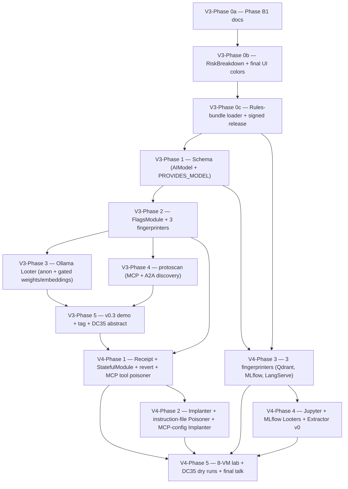

# AgentHound v0.3 + v0.4+ — Multi-Release Implementation Plan

> **Status:** Plan, not implementation. No code changes from this document until v0.2 ships and is tagged.
> **Companion to:** `docs/plans/sprint3-offensive-primitives.md` (design) and `docs/plans/v0.2-implementation.md` (v0.2 phase plan).
> **Final location once approved:** `docs/plans/v0.3-v0.4-implementation.md`.
> **No effort/timeline estimates.** Phases are deliverables + acceptance criteria, ordered by dependency.

---

## Context

v0.2 shipped the offensive surface that turns AgentHound's credential-chain pitch from theory into a recorded RTV demo. Two fingerprinters (Ollama, LiteLLM), one Looter (LiteLLM master-key → upstream provider keys), the cross-collector merge primitive (`value_hash` + `cross_service_credential_chain` post-processor), and the multi-label `:OllamaInstance:AIService` schema — 21 node kinds, 23 edge kinds. v0.2 deliberately deferred Phase B work (docs, RiskBreakdown panels, final placeholder colors, rules-bundle loader) and seven non-LiteLLM service surfaces.

This plan covers everything remaining — v0.3 + v0.4 in a single document because they share architecture (FlagsModule sidecar, the rules-bundle loader, schema patterns) and dependency order. v0.3 broadens the scan surface and hardens operations. v0.4 crosses the destructive-action line — Poisoner, Implanter, Extractor — gated by a Reverter contract that already exists in the SDK.

The two releases together produce the substrate for a DEF CON 35 main-stage talk in 2027: not a credential demo (RTV did that), but a full agent-infrastructure attack chain — discover MCP servers on a CIDR, enumerate the agent-side trust graph, poison a tool description, watch the agent execute the poisoned tool, revert.

Anything past v0.4 (template ecosystem, multi-user reintroduction, brute-force) stays out-of-scope.

---

## Architectural decisions

These resolve open questions before V3-Phase 1 commits.

### A. `FlagsModule` interface shape: pure side-interface

**Decision.** `type FlagsModule interface { RegisterFlags(*pflag.FlagSet) }` as a pure side-interface, type-asserted by the CLI dispatcher. Modules that need flags add the method; modules that don't, don't. Mirrors how `action.Looter` / `action.Fingerprinter` already compose with `module.Module` — registry holds `module.Module`, callers type-assert for capability.

### B. MCP/A2A network discovery: separate `modules/protoscan/` module

**Decision (locked).** Keep `modules/networkscan/` AI-service-only. Add a sibling `modules/protoscan/` for MCP `initialize` JSON-RPC handshakes and A2A well-known agent-card probes. Reasons:

- `networkscan` is a TCP port-sweeper feeding fingerprinter dispatch. MCP detection is a JSON-RPC POST with body content; A2A detection is a GET to a well-known path with JSON Schema validation. Mixing these into the same worker pool muddies the contract.
- `protoscan` reuses the same CIDR expansion (`modules/networkscan/expand.go`) and the same authorization gates. New CLI surface: `agenthound discover <cidr>` runs both.

### C. Ollama Looter v0.3 scope: anonymous default, flag-gated stretch IN v0.3

**Decision (locked).** Default Loot scope: `/api/tags` (model inventory) + `/api/show` (modelfile). v0.3 ALSO ships `--include-weights` (default off) and `--include-embeddings` (default off) — gated extras land in v0.3, not v0.4. Reasons:

- Anonymous loot of model inventory + modelfile is the demo: showcase a custom fine-tune name and the embedded system prompt without triggering bandwidth alerts.
- Weight extraction is multi-GiB. Gating behind explicit operator opt-in matches LiteLLM's `--include-credential-values` pattern.
- Embeddings inference consumes operator-billed compute. Gated via separate flag for clean OPSEC accounting.

### D. AIModel node kind: per-kind only, dedicated `PROVIDES_MODEL` edge

**Decision (default — revisit at V3-Phase 1 if implementer prefers reusing `EXPOSES`).** `AIModel` is a per-kind label only; no umbrella label. Model artifacts are owned, not exposed. New raw edge kind `PROVIDES_MODEL` from `OllamaInstance` to `AIModel`, joining the eight existing `PROVIDES_*` edges. Properties: `name`, `service_id`, `digest`, `family`, `parameters`, `is_finetune`, `value_hash` (SHA-256 of the modelfile content from `/api/show`).

### E. Rules-bundle release cadence: workflow_dispatch + on-tag, no schedule

**Decision.** Triggers: `workflow_dispatch` (manual) + `on: push: tags: ['rules-v*']`. Bundle releases are content-driven, not calendar-driven — `on: schedule` encourages empty releases that confuse cosign verification on the consumer side.

### F. StatefulModule storage: `~/.agenthound/state/<module-id>/<engagement-id>.json`

**Decision.** Co-locate with `~/.agenthound/loot-acknowledged` and `~/.agenthound/server.token`. One JSON file per (module, engagement) pair so `agenthound revert <engagement-id>` walks all module directories under `state/` and dispatches per-module Revert. Mode 0600, directory 0700.

### G. Poisoner safety gates: full set, no shortcuts

**Decision.** All four gates ship together.

1. **Reverter mandatory.** Compile-time enforced — `Poisoner` already embeds `Reverter` in `sdk/action/poisoner.go`. Module registration panics if Reverter isn't satisfied.
2. **Default `--commit=false`.** Without `--commit`, the Poisoner runs end-to-end but writes no mutating HTTP requests; receipt JSON records `dry_run: true`.
3. **AUTHORIZED prompt + sentinel.** Mirror `requireLootAcknowledged` — separate `~/.agenthound/poison-acknowledged` sentinel because Poisoner risk profile is materially different from Looter (audit trail vs. content tampering).
4. **Receipt persistence.** Per decision F.

### H. DEF CON 35 demo cut: minimum subset for the talk

**Decision.** v0.3 ships complete. v0.4 ships ALL phases — the demo cut is the recordable subset, not a ship-cut. The talk arc:

1. `agenthound scan 10.0.0.0/24` — find Ollama, LiteLLM, MCP server, A2A agent.
2. `agenthound loot ollama-host:11434 --type ollama` — exfil model inventory + modelfile, leak system prompt.
3. `agenthound loot litellm-host:4000 --type litellm --master-key sk-...` — chain to upstream provider keys.
4. `agenthound poison <mcp-host> --type mcp.tool.description --inject "..." --commit --engagement-id DC35-DEMO` — live poison.
5. Live agent calls poisoned tool; explorer Cypher shows new POISONED_DESCRIPTION edge.
6. `agenthound revert DC35-DEMO` — rolls back. Cypher confirms edge is gone.

Total live demo ~12 minutes inside a 45-minute slot.

---

## Dependency graph



`PB3 → P31` is load-bearing: any v0.3 fingerprinter ships its YAML in the rules-bundle release tarball. Without the loader, fixing a bad fingerprint regex requires cutting a binary release. `P32 → P41` is also load-bearing: the destructive CLI dispatches per-module flags via FlagsModule.

---

## v0.3 phases

### V3-Phase 0a — Phase B1 documentation closeout

**Goal.** Land the four doc files v0.2 deferred so the v0.2 tag isn't documentation-debt.

**Deliverables.**
- `docs/scanner.md` (NEW) — operator guide. Top-of-file CFAA legal warning; `--allow-public-targets` semantics; `--authorization-file` watermark recipe; full `--ports` list with v0.2 vs v0.3+ fingerprinter coverage.
- `docs/loot-litellm.md` (NEW) — LiteLLM-specific Looter guide. Master-key safety, audit-trail residue caveat (LiteLLM Postgres + LangFuse + SIEM), `--engagement-id` correlation pattern.
- `CLAUDE.md` — append the 9 v0.2 node kinds + `EXPOSES` + `EXPOSES_CREDENTIAL` to the Graph Data Model section. Document `value_hash` as the cross-collector merge primitive.
- `README.md` — one-paragraph network scanner + LiteLLM Looter blurb. Two example invocations.
- `CHANGELOG.md` — v0.2.0 section.

**Acceptance.** All five files committed; CLI examples in README match real behavior.

**Verification.** `git diff main -- docs/ README.md CHANGELOG.md CLAUDE.md` shows the changes; markdown lint clean.

### V3-Phase 0b — RiskBreakdown panels + final placeholder UI colors

**Goal.** Eliminate "Risk breakdown not available" for Ollama/LiteLLM nodes; replace placeholder palette for the six v0.3+ kinds.

**Deliverables.**
- `server/ui/src/components/inspector/RiskBreakdown.tsx:33` — add `OllamaInstance` and `LiteLLMGateway` to `COMPONENT_KEYS`. Per-kind property rows (Ollama: model count, modelfile presence, anonymous-loot capability; LiteLLM: master-key presence, virtual-key count, upstream-provider count).
- `server/ui/src/theme/tokens.ts:31-36` — replace placeholder colors. Resolve the `LangServeApp #7E57C2` collision with the AIService umbrella color.
- `server/ui/src/lib/explorer/hex-config.ts:194-241` — final icon choices.

**Acceptance.** No two `NODE_KIND_COLORS` entries share a hex value; `npm test` in `server/ui` passes.

**Verification.** `npm run build` in server/ui succeeds; explorer screenshot shows distinct hexagons for all eight AI service kinds.

### V3-Phase 0c — Rules-bundle loader + signed-tarball release

**Goal.** Decouple fingerprint-rule updates from binary releases. Hard prerequisite for V3-Phase 2.

**Deliverables.**
- `sdk/rules/bundle.go` (NEW) — `LoadFingerprintBundle(path string) ([]FingerprintRule, error)`. Accepts a directory or tar.gz; merges into the embedded set with explicit override semantics (rule with same `id` from bundle wins). Cosign signature verification optional via `--bundle-signature <path>` + `--bundle-cert <path>`. Mandatory verification deferred to v0.5.
- `collector/cli/scan.go` (edit) — add `--rules-bundle <path>` persistent flag. Threads through `loadRulesEngineOrNil` at line 247-255.
- `.github/workflows/rules-bundle.yml` (NEW) — `workflow_dispatch` + `on: push: tags: ['rules-v*']`. Steps: tar `sdk/rules/builtin/`, cosign sign, upload as release asset.
- `docs/rules-bundle.md` (NEW) — operator guide: download, verify, point `--rules-bundle` at the tarball.

**Acceptance.** `agenthound scan --rules-bundle ./rules.tar.gz 10.0.0.5` overrides the embedded `ollama.yaml` if the bundle contains a same-id rule. The CI workflow produces a release artifact when manually triggered.

**Verification.** `cosign verify-blob --certificate ... --signature ... rules.tar.gz` succeeds; `agenthound scan ... --rules-bundle <bad-path>` errors cleanly.

### V3-Phase 1 — Schema: AIModel node kind + PROVIDES_MODEL edge + EXPOSES first emitter

**Goal.** Land the schema deltas v0.3 collectors will emit. Schema-first so the writer/validator ships before emitting code touches them.

**Deliverables.**
- `sdk/ingest/kinds.go:7` — add `AIModel: true` to `AllowedNodeKinds`. Update count comment 21 → 22.
- `sdk/ingest/kinds.go:34` — add `"AIModel"` to `AllNodeLabels`. Update count comment 23 → 24.
- `sdk/ingest/kinds.go:59` — add `PROVIDES_MODEL: true` to `RawEdgeKinds` (16 raw).
- `sdk/ingest/kinds.go:78` — add `PROVIDES_MODEL: true` to `AllowedEdgeKinds` (24 total = 16 raw + 8 composite).
- `sdk/ingest/kinds.go:121` — add `"PROVIDES_MODEL": {SourceKinds: []string{"OllamaInstance"}, TargetKinds: []string{"AIModel"}}` to `EdgeKindEndpoints`.
- `sdk/ingest/model_test.go` — bump `len(AllowedNodeKinds) != 22`, `len(AllNodeLabels) != 24`, `len(AllowedEdgeKinds) != 24`. Add regression test asserting AIModel + PROVIDES_MODEL present.
- `server/internal/graph/schema.go` — `:AIModel` auto-gets a uniqueness constraint via the existing label loop (it's not in `UmbrellaLabels`).
- `server/ui/src/theme/tokens.ts` and `server/ui/src/lib/explorer/hex-config.ts` — add `AIModel` color (suggest `#F44336` red, distinct from `Credential #EC4899` pink) and icon (`Database` from lucide-react). Column 2 ("Tools & Skills") groupLabel "AI Models".

**Decision-point.** If during implementation reusing the existing `EXPOSES` edge for AIModel feels cleaner than introducing `PROVIDES_MODEL`, that's a defensible alternate path — `PROVIDES_MODEL` is the recommended default per architectural decision D, but not load-bearing.

**Acceptance.** Ingest of an envelope with `Kinds: ["AIModel"]` and an edge `OllamaInstance -[PROVIDES_MODEL]-> AIModel` round-trips through the writer and surfaces in the explorer.

**Verification.** `go test ./sdk/ingest/...` passes; manual ingest writes to Neo4j; explorer renders the AIModel hexagon.

### V3-Phase 2 — FlagsModule sidecar + three fingerprinters (vLLM, Open WebUI, Jupyter)

**Goal.** Triple the scan surface. Introduce FlagsModule alongside the first module that needs per-module flags (Ollama Looter in V3-Phase 3 — wire here so V3-Phase 3 only writes the Looter).

**Deliverables.**
- `sdk/module/flags.go` (NEW) — pure side-interface per decision A:
  ```go
  type FlagsModule interface {
      RegisterFlags(fs *pflag.FlagSet)
  }
  ```
  Plus a registry helper `module.RegisterFlagsFor(cmd *cobra.Command, m Module)` that does the type-assertion and wires the FlagSet.
- `sdk/rules/builtin/fingerprints/vllm.yaml` (NEW) — GET `/v1/models`. Match `http_status: 200` + `json_path: $.object equals: list` + `json_path: $.data exists: true`. Default port 8000.
- `sdk/rules/builtin/fingerprints/openwebui.yaml` (NEW) — GET `/api/version`. Plus a SECOND probe to `/api/config` capturing `$.ollama.base_url` for the EXPOSES edge target. Default port 3000.
- `sdk/rules/builtin/fingerprints/jupyter.yaml` (NEW) — GET `/api`. Disambiguates from Ollama via header `X-Jupyter-Server: ...` (presence-only `http_header` matcher). Default port 8888.
- `modules/vllmfp/{fingerprinter.go,register.go,fingerprinter_test.go}` (NEW) — clone `modules/ollamafp/` pattern verbatim. Module ID `vllm.fingerprint`, target `vllm`.
- `modules/openwebuifp/{...}` (NEW) — same pattern. Module ID `openwebui.fingerprint`, target `openwebui`. **First emitter of `EXPOSES`** — when `/api/config` reveals `ollama.base_url`, emit `OpenWebUIInstance -[EXPOSES]-> OllamaInstance` with the captured URL as evidence. Writer's `MERGE` semantics handle the case where the target Ollama node doesn't exist yet.
- `modules/jupyterfp/{...}` (NEW) — same pattern. Module ID `jupyter.fingerprint`, target `jupyter`.

**Acceptance.** `agenthound scan 10.0.0.0/24` against a lab with one of each service emits 5 distinct fingerprint matches. Open WebUI's match emits the `EXPOSES` edge to its backend Ollama. Existing Ollama and LiteLLM fingerprinter tests still pass.

**Verification.** `go test ./modules/vllmfp/... ./modules/openwebuifp/... ./modules/jupyterfp/...` passes; smoke test against `docker/demo/` shows 5 nodes + at least one EXPOSES edge.

### V3-Phase 3 — Ollama Looter (anon + flag-gated weights/embeddings, all in v0.3)

**Goal.** Second concrete Looter. Validates FlagsModule against a real consumer. First emitter of `AIModel` + `PROVIDES_MODEL`.

**Deliverables.**
- `modules/ollamaloot/looter.go` (NEW) — clone `litellmloot/looter.go` structure. Probes:
  - `GET /api/tags` (anon) — emits one `AIModel` node per model. Edge: `OllamaInstance -[PROVIDES_MODEL]-> AIModel`.
  - `GET /api/show` per-model (anon) — populates `modelfile`, `template`, `parameters` properties. Sets `value_hash = HashCredentialValue(modelfile-content)` so cross-collector chain semantics extend to model artifacts (a fine-tune leaked via Ollama matches the same modelfile if discovered another way).
  - `POST /api/embeddings` (anon, **gated by `--include-embeddings`**, default off) — generates a tiny benchmark embedding to confirm compute is consumable. Emits a `embedding_capability_confirmed: true` evidence property on the OllamaInstance node. The Looter contract is GET-only by default; this POST is documented as the explicit exception, allowed because it's read-only-in-effect on the target.
  - `GET /api/blobs/<digest>` (anon, **gated by `--include-weights`**, default off, requires `--weights-dir`) — bandwidth-heavy. Streams to disk. Emits `weight_artifact_path` property on the AIModel node.
- `modules/ollamaloot/register.go` (NEW) — module ID `ollama.loot`, action `Loot`, target `ollama`, IsDestructive false. Implements FlagsModule:
  ```go
  func (l *Looter) RegisterFlags(fs *pflag.FlagSet) {
      fs.Bool("include-weights", false, "Extract model weights via /api/blobs/<digest> (multi-GiB, very loud)")
      fs.String("weights-dir", "", "Directory to write extracted weights into (required with --include-weights)")
      fs.Bool("include-embeddings", false, "Issue test embedding calls via /api/embeddings (consumes operator-billed compute)")
  }
  ```
- `modules/ollamaloot/{looter_test,redaction_test,get_only_test}.go` (NEW) — three test files mirror `litellmloot/`. `get_only_test.go` enforces GET EXCEPT the documented `/api/embeddings` POST exception with an explicit allowlist comment.
- `collector/cli/loot.go:64-71` (edit) — replace static flag block with a dispatch that calls `module.RegisterFlagsFor(lootCmd, mod)` after `module.GetByTarget` resolves. Per-module flags move from init() time to dispatch time.

**Acceptance.** `agenthound loot 10.0.0.42:11434 --type ollama --engagement-id RTV-2027-001` emits N AIModel nodes + N PROVIDES_MODEL edges + ≥1 OllamaInstance node, all with `value_hash` populated. With `--include-weights --weights-dir /tmp/loot/`, weights download and the AIModel node carries the artifact path. Without the flag, no /api/blobs probe issued. `--include-weights` without `--weights-dir` errors cleanly.

**Verification.** `go test ./modules/ollamaloot/...` passes; integration: `agenthound loot ... --type ollama` against demo Ollama shows expected node count.

### V3-Phase 4 — protoscan: MCP + A2A network discovery

**Goal.** Extend "find services" beyond the AI-service port set. v0.2 finds infrastructure; v0.3 finds the agent-side surface.

**Deliverables.**
- `modules/protoscan/scanner.go` (NEW) — separate worker pool from `networkscan`. Two probe modes:
  - **MCP mode**: TCP connect to common ports (3000, 8080, 8000, custom via `--mcp-ports`), then HTTP POST to `/` and `/mcp` with JSON-RPC `initialize` body. Match on response shape `{"jsonrpc": "2.0", "id": 1, "result": {"capabilities": {...}, "serverInfo": {...}}}`. Emits `MCPServer` node with `discovered_via=network_scan`. (Existing MCP collector emits MCPServer nodes from configured URLs; this is the network alternative — same node kind, different discovery path.)
  - **A2A mode**: HTTP GET to `/.well-known/agent-card.json` on each open port. JSON Schema validation against existing A2A agent-card shape. Emits `A2AAgent` node.
- `modules/protoscan/register.go` (NEW) — register two modules: `mcp.discover` and `a2a.discover`. Both use the new `Discover` action.
- `sdk/action/action.go:7-15` (edit) — add `Discover Action = "discover"` constant.
- `collector/cli/discover.go` (NEW) — CLI verb `agenthound discover <cidr>` with `--mcp` / `--a2a` flags (default both). Reuses `requireAuthorizedPrompt` and `--authorization-file` from `scan.go`. Output envelope identical to `scan` so `agenthound-server ingest` accepts it through the same path.
- `docs/discover.md` (NEW) — operator guide. Same legal warning header as `scanner.md`.

**Acceptance.** `agenthound discover 10.0.0.0/24` against a lab containing a real MCP server + A2A agent emits two new nodes (MCPServer, A2AAgent) discovered via network. Combined with `agenthound scan` output, the explorer shows the agent-infrastructure topology.

**Verification.** `go test ./modules/protoscan/...` passes; integration against demo lab shows expected discoveries; `agenthound discover --help` shows the legal warning at the top of help text.

### V3-Phase 5 — v0.3 demo lab + tag + DEF CON 35 abstract draft

**Goal.** Bundle V3-Phase 0 through V3-Phase 4 into a recordable demo + the cut needed for the talk submission.

**Deliverables.**
- `docker/demo/v0.3/docker-compose.yml` (NEW) — five AI services (Ollama, LiteLLM, vLLM, Open WebUI pointed at the Ollama container, Jupyter) + one MCP server + one A2A agent.
- `scripts/seed-demo-v0.3.sh` (NEW) — preload Ollama with a "support-agent-v3" fine-tune (anonymized weights from a public model + a planted system prompt that leaks a synthetic role description).
- `testdata/demo/scan_lab_v0.3.json` (NEW, generated) — full sweep output.
- `CHANGELOG.md` — v0.3.0 section.
- `docs/cfp/defcon-35-abstract.md` (NEW, draft) — 250-word abstract for DC35 main-stage CFP.
- Git tag `v0.3.0`.

**Acceptance.** `docker compose up` followed by `agenthound scan + agenthound discover + agenthound loot --type ollama + agenthound loot --type litellm` produces a single ingest envelope that fires the cross_service_credential_chain processor.

**Verification.** `make demo-v0.3` succeeds; `agenthound-server` shows expected findings.

---

## v0.4 phases

### V4-Phase 1 — Receipt + StatefulModule + revert CLI + MCP tool poisoner

**Goal.** First destructive action. Ship the full Reverter contract — Poisoner that mutates an MCP server's tool description, persistent receipt, `agenthound revert <engagement-id>` rolls it back.

**Deliverables.**
- `sdk/action/poisoner.go:14-21` (edit) — replace stubs with concrete shapes:
  ```go
  type PoisonPayload struct {
      InjectionContent string
      TargetID         string  // MCPTool.objectid for tool poisoning
      Mode             string  // "append" | "replace" | "prepend"
      EngagementID     string
      DryRun           bool
  }
  type PoisonReceipt struct {
      ModuleID         string
      EngagementID     string
      Target           Target
      OriginalContent  string  // required for revert
      InjectedContent  string
      AppliedAt        time.Time
      DryRun           bool
  }
  ```
- `sdk/module/stateful.go` (NEW) — `StatefulModule` sidecar interface per decision F:
  ```go
  type StatefulModule interface {
      StateDir() string
      WriteReceipt(engagementID string, r action.Receipt) (path string, err error)
      ReadReceipts(engagementID string) ([]action.Receipt, error)
  }
  ```
  Plus a default helper `module.NewFileStatefulModule(moduleID string)` that handles directory creation, file mode 0600, JSON encode/decode.
- `modules/mcppoison/{poisoner.go,reverter.go,register.go,*_test.go}` (NEW) — first concrete Poisoner. Targets `mcp.tool.description`. Probes:
  - JSON-RPC `tools/list` to fetch the current tool description (ORIGINAL CONTENT — captured into receipt).
  - JSON-RPC `tools/update` (or live MCP server admin endpoint) with the injected description.
  - Receipt persisted via StatefulModule.
  - Implements `Reverter`: `Revert(ctx, receipt)` calls `tools/update` with the original content from the receipt.
  - Tests: happy path, dry-run produces receipt without mutating, revert with stale receipt errors cleanly, double-revert is idempotent.
- `collector/cli/poison.go` (NEW) — replace stub at `collector/cli/stubs.go:43`. CLI: `agenthound poison <host> --type <kind> --inject <content> --target-id <id> [--commit] --engagement-id <id>`. Default `--commit=false`. AUTHORIZED prompt + `~/.agenthound/poison-acknowledged` sentinel. Per-module flags via FlagsModule.
- `collector/cli/revert.go` (NEW) — new CLI verb `agenthound revert <engagement-id>`. Walks `~/.agenthound/state/*/`, reads each module's receipts matching engagement-id, dispatches `Revert` per module, prints summary. Idempotent — already-reverted receipts surface as no-ops.
- `collector/cli/stubs.go:42-44` (edit) — drop `poison` from stub list. `extract` and `implant` stay.
- `docs/poison.md` (NEW) — operator guide. Heavy emphasis on safety gates (Reverter mandatory, dry-run default, engagement-id correlation, receipt directory). CFAA / Computer Misuse Act warnings front-and-center.

**Acceptance.** `agenthound poison <host> --type mcp.tool.description --target-id <tool-id> --inject "..." --commit --engagement-id DC35-DEMO` mutates the live tool description and writes a receipt. `agenthound revert DC35-DEMO` restores the original.

**Verification.** `go test ./modules/mcppoison/... ./sdk/module/...` passes; integration against a sacrificial MCP container shows poison+revert round-trip; `--commit=false` writes receipt with `dry_run: true` and no HTTP mutation.

### V4-Phase 2 — Implanter + agent-instruction Poisoner + MCP-config Implanter

**Goal.** Second destructive surface. Implanter for persistence, Poisoner extension to instruction files (CLAUDE.md, AGENTS.md, agent-instruction overrides).

**Deliverables.**
- `sdk/action/implanter.go:14-21` (edit) — concrete `ImplantPayload` and `ImplantReceipt` shapes mirroring V4-Phase 1.
- `modules/instructionpoison/` (NEW) — Poisoner targeting instruction files. Probes file system via `--file <path>`. Inserts an injection block bracketed by sentinel comments (`<!-- agenthound-poison-START -->` / `<!-- agenthound-poison-END -->`) so revert is trivial: regex-strip the bracketed block. Receipts capture file SHA-256 before/after.
- `modules/mcpconfigimplant/` (NEW) — Implanter targeting MCP client configs. Adds a malicious server entry to `~/.cursor/mcp.json` etc. Sentinel-bracketed JSON insertion. Receipts capture original file content.
- `collector/cli/implant.go` (NEW) — replace stub. Same FlagsModule + AUTHORIZED + sentinel pattern as poison.
- `collector/cli/stubs.go:42-44` (edit) — remove `implant` from stub list. Only `extract` remains.

**Acceptance.** `agenthound implant <host> --type mcp.config.malicious-server --config-path ~/.cursor/mcp.json --commit --engagement-id ...` adds the entry. Revert removes it. Same for instructionpoison against a CLAUDE.md.

**Verification.** Test against a sacrificial test directory; revert produces byte-identical pre-state.

### V4-Phase 3 — Three fingerprinters complete the 8-set (Qdrant, MLflow, LangServe)

**Goal.** Close the v0.2 promise: 8 services fingerprinted.

**Deliverables.**
- `sdk/rules/builtin/fingerprints/qdrant.yaml` — GET `/` returning Qdrant version JSON + `/collections` to enumerate.
- `sdk/rules/builtin/fingerprints/mlflow.yaml` — GET `/api/2.0/mlflow/experiments/list` returning JSON.
- `sdk/rules/builtin/fingerprints/langserve.yaml` — GET `/docs/` returning OpenAPI.
- `modules/qdrantfp/`, `modules/mlflowfp/`, `modules/langservefp/` (NEW) — same pattern as v0.3.

**Acceptance.** All eight `NODE_KIND_COLORS` entries from `tokens.ts` have live emitters.

**Verification.** Demo lab spinning all 8 services produces 8 fingerprint matches.

### V4-Phase 4 — Jupyter + MLflow Looters + Extractor v0

**Goal.** Cap the offensive surface with the high-value notebook + MLflow extraction paths.

**Deliverables.**
- `modules/jupyterloot/` (NEW) — anonymous Jupyter probes: `/api/sessions`, `/api/contents/`, environment variables via kernel introspection. Public notebook content is the loot.
- `modules/mlflowloot/` (NEW) — `/api/2.0/mlflow/experiments/list`, `/api/2.0/mlflow/runs/search`, artifact download via `/api/2.0/mlflow-artifacts/artifacts/`. Pickled-model RCE-on-load is documented but NOT triggered — Looter is read-only.
- `sdk/action/extractor.go:14-18` (edit) — concrete `ExtractOptions` and `ExtractResult` shapes. v0.4 first cut: model-weight inversion proof-of-concept.
- `modules/embeddinginvert/` (NEW) — proof-of-concept Extractor. Takes an `AIModel` node + extracted weights from V3-Phase 3 ollama loot, runs an embedding-inversion algorithm, emits `ExtractedTraining{kind: "training-signal", confidence: ...}` ingest payload. Heavy — gated entirely behind `--commit` like Poisoner.
- `collector/cli/extract.go` (NEW) — replace the final stub. FlagsModule pattern.
- `collector/cli/stubs.go` (edit) — file becomes empty (all four destructive verbs implemented). Remove the stub init() block.

**Acceptance.** `agenthound loot <jupyter> --type jupyter` emits notebook nodes + env var Credentials. `agenthound extract <ai-model-node> --type embedding-invert` produces probabilistic training signals.

**Verification.** Test against sacrificial Jupyter container; extract test against a known synthetic-trained model.

### V4-Phase 5 — 8-VM lab + DEF CON 35 dry runs + final talk

**Goal.** The talk-day deliverable.

**Deliverables.**
- `docker/demo/v0.4/docker-compose.yml` (NEW) — full 8-service lab plus the MCP server + A2A agent + CLAUDE.md fixture host.
- `scripts/dc35-demo.sh` (NEW) — scripted talk demo (the 6-step arc from decision H). Includes timing markers for live narration.
- `docs/cfp/defcon-35-final.md` — final talk slides.
- `docs/v0.4-implementation-retro.md` (NEW) — what shipped vs. what slipped. Honest accounting.
- Git tag `v0.4.0`.

**Acceptance.** Three full dry runs of the demo arc complete without intervention. Recording suitable for talk submission backup.

**Verification.** `make demo-dc35` runs end-to-end; recorded screen capture archived.

---

## DEF CON 35 demo cut — minimum recordable subset

For the talk submission:

**Required from v0.3:** V3-Phase 0a (docs), V3-Phase 0c (rules-bundle — for any post-CFP rule fixes without binary releases), V3-Phase 1 (AIModel schema), V3-Phase 2 (3 new fingerprinters — three of the visible services in the demo), V3-Phase 3 (Ollama Looter — modelfile-leak narrative beat), V3-Phase 4 (protoscan — finds the MCP server the demo poisons), V3-Phase 5 (demo lab + abstract).

**Required from v0.4:** V4-Phase 1 (MCP tool poisoner + revert CLI — the live demo's apex). V4-Phase 2 (CLAUDE.md backdoor — strong "even your config files aren't safe" closer; ship if rehearsals land under 35 minutes).

**Optional, recommended if time allows:** V3-Phase 0b (RiskBreakdown — improves explorer screen-share polish during Q&A pivot).

**Explicitly NOT required for the talk recording:** V4-Phase 3 (Qdrant/MLflow/LangServe — not on screen). V4-Phase 4 (Jupyter/MLflow Looters + Extractor — bonus repo material, would distract from the chain). V4-Phase 5 lab assembly is required, but the recording uses the four-host subset (Ollama, LiteLLM, MCP server, target host with CLAUDE.md).

**The plan ships ALL phases regardless** — the demo cut only describes what's on camera during the talk. v0.4 Phases 3 and 4 are still ship-required for v0.4 to be tagged.

---

## Out-of-scope (deferred beyond v0.4)

- **Template ecosystem split.** Community-contributed YAML matchers in a separate repo. Lands when there's external contributor demand. Rules-bundle loader from V3-Phase 0c is the substrate; the split is operational.
- **Per-action binaries.** Stays monolithic. Defer until binary size is a real distribution problem.
- **Multi-user reintroduction.** 127.0.0.1 + localhost token holds. Adding remote multi-user is a separate threat model exercise.
- **Brute-force / credential-discovery.** Stays out — this is BloodHound for AI infrastructure, not a credential-attack tool.
- **Cosign-mandatory bundle verification.** V3-Phase 0c ships optional verification. Mandatory (refuse to load unsigned bundles) lands in v0.5 after the release pipeline has a track record.
- **MCP server poison-detection forensics.** Defensive add-on, separate work.

---

## Critical files index

| File | Phase | Change kind |
|---|---|---|
| `docs/scanner.md`, `docs/loot-litellm.md` | V3-0a | NEW |
| `CLAUDE.md`, `README.md`, `CHANGELOG.md` | V3-0a | Edit |
| `server/ui/src/components/inspector/RiskBreakdown.tsx` | V3-0b | Edit at line 33 |
| `server/ui/src/theme/tokens.ts` | V3-0b | Edit lines 31-36 |
| `server/ui/src/lib/explorer/hex-config.ts` | V3-0b | Edit lines 194-241 |
| `sdk/rules/bundle.go` | V3-0c | NEW |
| `.github/workflows/rules-bundle.yml` | V3-0c | NEW |
| `docs/rules-bundle.md` | V3-0c | NEW |
| `collector/cli/scan.go` | V3-0c | Edit — `--rules-bundle` flag |
| `sdk/ingest/kinds.go` | V3-1 | Edit — AIModel + PROVIDES_MODEL across 5 maps |
| `sdk/ingest/model_test.go` | V3-1 | Edit — count bumps + regression |
| `server/internal/graph/schema.go` | V3-1 | Edit — `:AIModel` constraint |
| `sdk/module/flags.go` | V3-2 | NEW |
| `sdk/rules/builtin/fingerprints/{vllm,openwebui,jupyter}.yaml` | V3-2 | NEW (3 files) |
| `modules/{vllmfp,openwebuifp,jupyterfp}/` | V3-2 | NEW (3 modules) |
| `modules/ollamaloot/` | V3-3 | NEW |
| `collector/cli/loot.go` | V3-3 | Edit — FlagsModule dispatch |
| `sdk/action/action.go` | V3-4 | Edit — add `Discover` constant |
| `modules/protoscan/` | V3-4 | NEW |
| `collector/cli/discover.go` | V3-4 | NEW |
| `docs/discover.md` | V3-4 | NEW |
| `docker/demo/v0.3/`, `testdata/demo/scan_lab_v0.3.json` | V3-5 | NEW |
| `docs/cfp/defcon-35-abstract.md` | V3-5 | NEW |
| `sdk/action/poisoner.go` | V4-1 | Edit — concrete payload/receipt |
| `sdk/module/stateful.go` | V4-1 | NEW |
| `modules/mcppoison/` | V4-1 | NEW |
| `collector/cli/poison.go`, `collector/cli/revert.go` | V4-1 | NEW |
| `collector/cli/stubs.go` | V4-1, V4-2, V4-4 | Edit — drop one stub per phase |
| `docs/poison.md` | V4-1 | NEW |
| `sdk/action/implanter.go` | V4-2 | Edit |
| `modules/instructionpoison/`, `modules/mcpconfigimplant/` | V4-2 | NEW |
| `collector/cli/implant.go` | V4-2 | NEW |
| `sdk/rules/builtin/fingerprints/{qdrant,mlflow,langserve}.yaml` | V4-3 | NEW |
| `modules/{qdrantfp,mlflowfp,langservefp}/` | V4-3 | NEW |
| `sdk/action/extractor.go` | V4-4 | Edit |
| `modules/jupyterloot/`, `modules/mlflowloot/`, `modules/embeddinginvert/` | V4-4 | NEW |
| `collector/cli/extract.go` | V4-4 | NEW |
| `docker/demo/v0.4/`, `scripts/dc35-demo.sh`, `docs/cfp/defcon-35-final.md` | V4-5 | NEW |

---

## Pre-implementation checklist

Resolve before V3-Phase 0a commits:

1. **FlagsModule shape.** Locked: pure side-interface, `RegisterFlags(*pflag.FlagSet)`. CLI dispatcher type-asserts.
2. **MCP/A2A discovery location.** Locked: separate `modules/protoscan/` module with new `Discover` action constant.
3. **Ollama Looter v0.3 scope.** Locked: anon by default, `--include-weights` and `--include-embeddings` flag-gated extras ship in v0.3 (not v0.4).
4. **AIModel edge.** Default: dedicated `PROVIDES_MODEL`. Revisit at V3-Phase 1 implementation if reusing `EXPOSES` is materially cleaner — both work; PROVIDES_MODEL preserves edge-kind semantic clarity.
5. **Rules-bundle release cadence.** Locked: `workflow_dispatch` + `on: push: tags: ['rules-v*']`. No `on: schedule`.
6. **StatefulModule storage.** Locked: `~/.agenthound/state/<module-id>/<engagement-id>.json`, mode 0600.
7. **Poisoner safety gates.** Locked: all four (Reverter mandatory, `--commit=false` default, AUTHORIZED prompt + sentinel, receipt persistence).
8. **DEF CON 35 demo cut.** Locked: ship ALL v0.3 + v0.4 phases. The "demo cut" is the recordable subset for the talk, not a ship-cut.

---

## Verification: end-to-end flow once everything ships

```bash
# 1. Spin up the v0.4 lab.
docker compose -f docker/demo/v0.4/docker-compose.yml up -d

# 2. Discover infrastructure (v0.3).
agenthound scan 10.0.0.0/24 --output - | tee /tmp/scan.json | \
  agenthound-server ingest -

# 3. Discover agent-side surface (v0.3).
agenthound discover 10.0.0.0/24 --output - | tee /tmp/discover.json | \
  agenthound-server ingest -

# 4. Loot Ollama (v0.3) — anonymous tags + modelfile.
agenthound loot 10.0.0.10:11434 --type ollama --engagement-id DC35-DEMO \
  --output - | agenthound-server ingest -

# 5. Loot LiteLLM (v0.2 baseline + cross-collector chain fires).
agenthound loot 10.0.0.20:4000 --type litellm \
  --master-key sk-DEMO-CHAIN-KEY-NOT-REAL \
  --engagement-id DC35-DEMO --output - | agenthound-server ingest -

# 6. Poison an MCP tool description (v0.4).
agenthound poison 10.0.0.30:8080 --type mcp.tool.description \
  --target-id <tool-id> --inject "..." --commit \
  --engagement-id DC35-DEMO

# 7. Verify the poison fired (live agent uses the poisoned tool).
#    Cypher in explorer: MATCH (t:MCPTool)-[r:POISONED_DESCRIPTION]->(t) RETURN t,r

# 8. Revert everything for this engagement (v0.4).
agenthound revert DC35-DEMO

# 9. Confirm rollback. Cypher returns no POISONED_DESCRIPTION edges.
```

If steps 1-9 produce a clean poison + revert cycle on top of the credential-chain finding from steps 4-5, v0.3 + v0.4 ship as planned.
