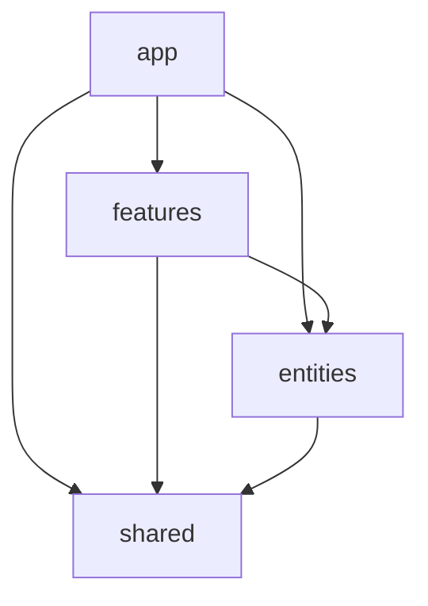

# AgentHound UI Architecture

The UI is organized as a **4-layer feature-sliced architecture**. Each layer may
only import from layers *below* it. This keeps domain logic out of the shared
kernel, keeps features independent, and makes the dependency graph acyclic.

> **Status:** Phase 1 (foundation) scaffolds the layers, path aliases, and the
> lint boundary. Existing code still lives under `src/components`, `src/api`,
> `src/hooks`, `src/lib`, and `src/store`; it is migrated into these layers in
> later workstreams. Until a file is moved, it is "unknown" to the boundary
> linter and unaffected.

## The four layers

| Layer | Path / alias | Responsibility |
|-------|--------------|----------------|
| **app** | `src/app` · `@app` | Composition root: entry, route table, providers (QueryClient, Router, root error boundary), app shell (layout/nav/sidebar). |
| **features** | `src/features/<x>` · `@features` | Self-contained product areas (dashboard, explorer, findings, inspector, queries, rules, scans). Each owns its `ui/` and `model/`. |
| **entities** | `src/entities/<x>` · `@entities` | Domain layer: typed view-models and per-entity data access (node, finding, scan, security, edge, rule, graph, ...). Rich models only where real logic exists. |
| **shared** | `src/shared` · `@shared` | Cross-cutting kernel with **no domain knowledge**: api client, design tokens/theme, UI kit (`primitives`/`layout`/`widgets`/`feedback`), generic libs, global styles. |

`@` continues to resolve to `src` for the unmigrated tree.

## Import-direction rule (enforced)

- **app** → may import features, entities, shared.
- **features** → may import entities, shared, and **only their own feature** (never a sibling feature).
- **entities** → may import shared and **sibling entities** (shared wire types like `entities/graph` are consumed across entities); never features or app.
- **shared** → may import shared only; **nothing upward**.

Enforced by [`eslint-plugin-boundaries`](https://www.jsboundaries.dev) (`boundaries/dependencies`)
in [`eslint.config.js`](./eslint.config.js). Run `npm run lint`.

## Where things go

| You are adding... | Put it in |
|-------------------|-----------|
| A route, provider, or app-shell chrome | `src/app/` (`@app`) |
| A widget/page for one product area | `src/features/<area>/ui/` |
| A hook/store/helper used by one feature | `src/features/<area>/model/` |
| A domain accessor / view-model / repository | `src/entities/<name>/` |
| A reusable shadcn primitive | `src/shared/ui/primitives/` |
| A layout primitive (Stack/Grid/Cluster) | `src/shared/ui/layout/` |
| A dashboard-kit widget / chart | `src/shared/ui/widgets/` |
| Loading/empty/error scaffolding | `src/shared/ui/feedback/` |
| The ky client or QueryClient config | `src/shared/api/` |
| A design token / color | `src/shared/theme/tokens.ts` (the **only** TS hex source) |
| A generic util (cn, format, hooks) | `src/shared/lib/` |

## Guardrails

- **Boundaries:** `npm run lint` (ESLint flat config; the four layers are the only "elements").
- **Design system:** `bash scripts/slop-check.sh` — no hex outside `theme/tokens.ts` / `styles/globals.css`; no hardcoded `grid-cols-N` outside `shared/ui/layout`.
- **Build/types:** `npm run build` (`tsc -b && vite build`). **Tests:** `npm test` (`vitest run`).
- CI runs lint + vitest + slop-check on every PR.
